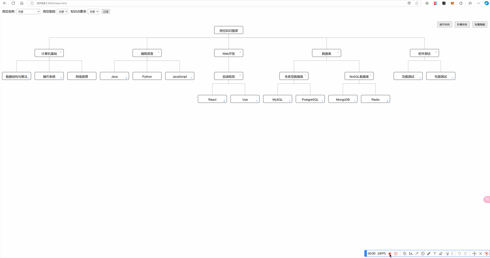

# 一个由AI驱动开发的应用示例

> 第一版


> 第二版
> 

这是一个由OpenAPI o1-preview开发的应用示例。第一版本共花费了3个小时左右，第二版本也差不多花费了3个小时左右。

完成的对话见：https://chatgpt.com/share/672f1c61-8df8-8011-abe2-65a92a93e3f2

## 关键交互

### 第一版

我
```
设计实现一个岗位要求与知识图谱系统。

有如下表结构：

岗位分类表：分类名称，父分类名称
岗位信息表：岗位名称、岗位分类名称、岗位介绍（可选）
知识表：知识点Id，知识点名称，知识点介绍（可选），父知识点Id（可选）
岗位知识关系表：岗位名称、岗位级别（枚举：实习、初级、中级、高级）、知识点Id、知识点要求（枚举：了解、掌握、熟悉、精通）、是否必备、是否重要

示例如下：

岗位分类表：
分类名称 = 技术， 父分类名称 = 无
分类名称 = 开发， 父分类名称 = 技术
分类名称 = 测试， 父分类名称 = 技术

岗位信息表：
岗位名称 = 平台开发工程师，岗位分类名称 = 开发，岗位介绍 = 负责平台化系统的研发
岗位名称 = 软件测试工程师，岗位分类名称 = 测试，岗位介绍 = 负责软件测试工作

知识表：
知识点Id = 1 ，知识点名称 = 数据库
知识点Id = 2 ，知识点名称 = 关联型数据库，父知识点Id = 1
知识点Id = 3 ，知识点名称 = Postgres，父知识点Id = 2
知识点Id = 4 ，知识点名称 = SQL基本操作，父知识点Id = 3，知识点介绍 = 会使用基础的SQL语句

岗位知识关系表：
岗位名称 = 平台开发工程师，岗位级别 = 初级，知识点名称 = 4，知识点要求 = 熟悉，是否必备 = 是，是否重要 = 是
岗位名称 = 平台开发工程师，岗位级别 = 高级，知识点名称 = 4，知识点要求 = 精通，是否必备 = 是，是否重要 = 是
岗位名称 = 软件测试工程师，岗位级别 = 高级，知识点名称 = 4，知识点要求 = 熟悉，是否必备 = 是，是否重要 = 是

要求：
1、生成Sqlite数据表结构
2、生成一个操作界面，整体上是一个过滤框和一个思维导图。思维导图按层级显示知识表的信息，根节点名称为知识图谱，按层级展开。
2.1、 各层级可以展开和折叠，展开和折叠时重新布局思维导图以显示得更优雅
2.2、 鼠标移入节点（知识点）时显示知识点介绍
2.3、 双击节点时出现一个弹窗，弹窗显示的是当前这个知识点对应的岗位知识关系列表。可以删除、编辑、新建岗位知识关系
2.4、 编辑、新建岗位知识关系再弹一个窗口，内容为岗位名称（下拉菜单，可选择所有的岗位名称）、岗位级别（枚举：实习、初级、中级、高级）、知识点要求（枚举：了解、掌握、熟悉、精通）、是否必备、是否重要。保存后将这些信息与当前的知识点关联。
2.5、 过滤框可以按岗位名称（下拉菜单，可选择所有的岗位名称）、岗位级别（下拉菜单）、知识点要求（下拉菜单）过滤显示思维导图的内容，过滤后重新布局思维导图以显示得更优雅
3、使用Javascript实现，不引入MVVM框架和CSS框架
4、界面美观、操作方便

以上要求，用代码实现。确保能正确执行。
```

OpenAI
```
<生成代码有问题，篇幅原因，本文不展示>
```

我
```
改进要求：
1） 生成更多的示例数据
2） 界面太丑，思维导图布局不正确
3） 过滤条件不生效，要求按按岗位名称、岗位级别、知识点要求过滤时仅显示与之有关联的知识点（要从叶子节点递归查找，返回有关联的知识点及其父知识点）
```

OpenAI
```
<生成代码有问题，篇幅原因，本文不展示>
```

我
```
            for (var key in knowledgeTreeMap) {
                knowledgeTreeMap[key].visible = false;
            }
以上代码报错：
test.html:410  Uncaught ReferenceError: knowledgeTreeMap is not defined
    at applyFilters (test.html:410:29)
    at loadDataAndRenderMindMap (test.html:343:13)
    at HTMLButtonElement.<anonymous> (test.html:305:17)
```

OpenAI
```
<此代码可以运行了，但我想要更多功能，篇幅原因，本文不展示>
```

我
```
可以运行了。需要优化几点：
1） 思维导图要有一个根节点，名叫“岗位知识图谱”
2） 过滤时有指定岗位名称的话，将根节点改名为对应的岗位名称
3） 为有存在岗位关联的思维导图的节点，在节点右下角添加一个计数，表明关联的岗位数
4） 思维导图要尽可能占满页面，要支持鼠标缩放操作
5） 思维导图添加展开所有、折叠所有按钮
6） 原来双击打开的弹窗方式改成在当前页面底部显示，有关闭按钮
7） 添加一个批量编辑的功能，点击批量编辑按钮后，思维导图所有节点都可以选择，选择一个或多个节点后，点击完成，弹出编辑窗口，进一步选择岗位名称、岗位级别、知识点要求、是否必备、是否重要 ，点击完成后即可将所有选择的节点（知识点）与填写的信息关联保存为岗位知识关系
```

OpenAI
```
<生成代码有问题，篇幅原因，本文不展示>
```

我
```
思维导图显示不了，代码有错误，请修正。
```

OpenAI
```
<生成代码有问题，篇幅原因，本文不展示>
```

我
```
还有好几个问题要修正：
1） mindMap这个svg显示得位置太小了，没有尽可能占满屏幕
2） 新建岗位知识关系的按钮点击无效果
3） 批量编辑时无法选中节点（节点没有多选框）
4） 思维导图节点上展开、折叠后没有重新计算思维导图的位置
5） UI美观度上要再优化，比如列表目前不显示表格边框
```

OpenAI
```
<生成代码有问题，篇幅原因，本文不展示>
```

我
```
还有几个小问题：
1） 批量编辑无法多选节点，建议去掉节点上的多选框，确保在批量编辑模式可单击选中或取消选中节点
2） 非批量编辑时原来的双击显示岗位知识关系改成单击显示
```

OpenAI
```
<生成代码有问题，篇幅原因，本文不展示>
```

我
```
批量编辑节点选择时，节点的选中与未选中样式没有区别，修正下。
```

OpenAI
```
<代码可以正常执行了>
```
完整代码见本项目的 `memory-version.html` 文件。

我
```
都可以了，现在要求sqlite的数据可以持久化，并可使用sqlite客户端工具编辑。
功能要求和之前的一样，修正代码以支持数据持久化，可以引入nodejs。
要求给出完整的代码。
```

OpenAI
```
<给出了过程代码，不完整>
```

我
```
不要让我参考之前的实现。给出完整实现。
```

OpenAI
```
<给出完整的可以运行的代码>
```

### 第二版


我
```
功能上都没有问题，不要修改功能。但有几点需要优化：
1） 目前的思维导图只能向下布局，当数据很多时，显示会乱。所以：
1.1） 思维导图要支持以根节点为中心，分别向四周展开
2） 当节点内容过长时，节点的宽度要能自适应内容的长度
3） 根节点也需要像子节点一样有展开、折叠的功能

给出有变动文件的完整代码。
```

OpenAI
```
<引入了D3.js，但遗漏了之前的一些功能>
```

我
```
整体上好多了。但有几个问题：
1） 在数据多时布局上会存在节点间的交叉，这个要修正
2） 原来单击查看岗位知识关系列表的功能没了，要加回来
3） 节点上有展开/折叠元素，单击该元素实现展开/折叠其子节点
4） 原来节点上显示关联岗位数量的功能没了，这个要加回来
```

OpenAI
```
<补充回了之前的功能>
```

我
```
好多了，再修正几个问题：
1） 节点的宽度除了要能完整显示内容外还要冗余引用计数的宽度
2） 点击展开所有时节点都挤在一起，没有展开。节点间间距的计算要从子节点递归
3） 节点展开/折叠的元素放到节点后面更自然
4） 知识点介绍的节点样式上去掉边框以区别与知识点类型的节点
5） 思维导图要支持鼠标缩放，支持整体拖动
```

OpenAI
```
<进一步完善>
```

又经过了几次对话，逐步形成了本项目看到的代码。但期o1-preview达到了限制的次数，降级成了o1-mini，后者比较“笨”，沟通比较困难。